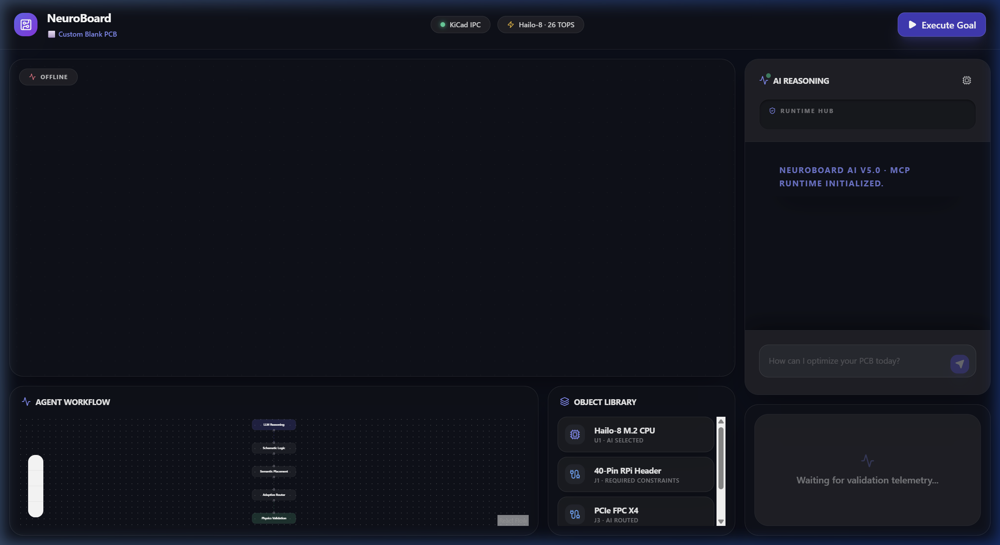
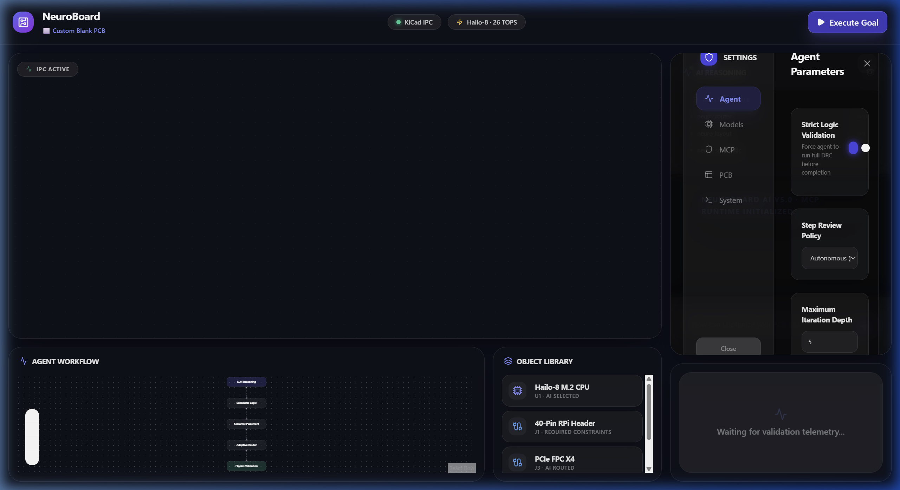

<h1 align="center">
  
</h1>

<p align="center">
  
</p>

<div align="center"> 
  <a href="https://bibek-das.vercel.app/" target="_blank" rel="noopener noreferrer">
    
  </a>
  <a href="mailto:bibekdas1055@gmail.com">
    
  </a>
  <a href="https://www.linkedin.com/in/bibek-das-364367323/" target="_blank">
    
  </a>
  <a href="https://www.instagram.com/bibek_ai_deas/" target="_blank">
    
  </a>
  <a href="https://youtube.com/@be-bibek" target="_blank">
    
  </a>
</div>
<br/>

> **"I built the world's first mobile-native, AI-driven EDA compiler that translates natural language prompts into fully structured, production-ready KiCad hardware files. Leveraging cross-model orchestration via Anthropic and Google APIs, the app automates the entire 'step-zero' hardware planning and schematic compilation process directly from a smartphone screen."**

<p align="center">
  
</p>

<p align="center">
  
  
  
  
  
</p>

---

## 📖 Table of Contents

- [Project Overview](#-project-overview)
- [Why NeuroBoard Exists](#-why-neuroboard-exists)
- [Core Features](#-core-features)
- [System Architecture](#-system-architecture)
- [Tech Stack](#%EF%B8%8F-tech-stack)
- [Project Structure](#-project-structure)
- [Requirements & Dependencies](#-requirements--dependencies)
- [Installation Guide](#-installation-guide)
- [How to Run](#-how-to-run)
- [How the Pipeline Works](#-how-the-pipeline-works)
- [Example Usage](#-example-usage)
- [Live Experience & Downloads](#-live-experience--downloads)
- [Development Workflow](#-development-workflow)
- [Troubleshooting](#-troubleshooting)
- [Roadmap](#-roadmap)
- [Contributing](#-contributing)
- [License](#-license)
- [Author](#-author)

---

## 🎯 Project Overview

**NeuroBoard** is an AI-driven PCB design platform that transforms natural language prompts into production-ready printed circuit board designs. It combines a **netlist-driven architecture** powered by SKiDL, an **agentic AI orchestration layer** using LangGraph, and **real-time KiCad 10 IPC integration** via native `api.sock` — all wrapped in a **Copilot-style desktop frontend** built with Tauri + React.

Instead of manually drawing schematics and placing components, you describe your hardware goal in plain English:

> *"Create a Raspberry Pi HAT with Hailo-8 AI accelerator and dual SD card slots"*

NeuroBoard's compiler pipeline handles the rest — from BOM generation to schematic synthesis, component placement, signal-integrity-aware routing, and live DRC validation — all streamed in real-time to your KiCad 10 canvas.

---

## 💡 Why NeuroBoard Exists

### The Problem

Traditional PCB design is a **manual, error-prone, multi-tool process**:

- Engineers spend hours on schematic entry, component selection, and footprint matching
- Library management across KiCad, LCSC, and manufacturer datasheets is fragmented
- Routing decisions require deep domain expertise in signal integrity and power delivery
- Iteration cycles are slow — a single design rule violation can cascade into hours of rework
- There is no unified AI layer that understands both electrical intent and physical constraints

### The Solution

NeuroBoard introduces a **compiler model** for hardware design:

- **Natural language in → Production PCB out**: Describe what you want, not how to build it
- **Transactional safety**: Atomic commits with rollback on DRC/ERC failure — your KiCad project is always valid
- **Real-time digital twin**: Every AI decision is mirrored live on a glassmorphic web dashboard
- **Physics-aware routing**: Signal integrity (scikit-rf) and power delivery network analysis (PySpice) are built into the pipeline, not bolted on

---

## ✨ Core Features

### 🤖 AI Copilot
- Natural language → structured PCB specification via intent parsing
- Agentic reasoning loop with LangGraph (plan → execute → reflect → retry)
- Multi-model LLM support (Gemini, GPT-4o, Claude) via pluggable `llm_factory`

### 🏗️ Hardware DSL & Synthesis
- **NeuroModule DSL**: Define hardware modules with constraint-aware abstractions
- **SKiDL-powered schematic generation**: Programmatic netlist creation, no GUI required
- **Automated BOM generation**: From intent to full bill of materials in seconds

### 🔍 Component Intelligence Engine
- **Neural Part Resolver**: Auto-fetch symbols and footprints from LCSC database (3M+ parts)
- **Library auto-fetching**: KiCad + LCSC integration via `JLC2KiCadLib`
- Intelligent component selection based on specifications and availability

### 📡 KiCad 10 IPC Real-Time Integration
- **Zero-latency RAM sync**: Direct communication via `api.sock` for instant canvas updates
- **Transactional pipeline**: Atomic design changes with full rollback on failure
- MCP server architecture (`neuro_layout`, `neuro_router`, `neuro_schematic`)

### 🛤️ Intelligent Routing
- Bus-aware topology detection and corridor optimization
- Differential pair routing with length matching
- Fanout planning and net-class-aware trace width assignment

### 🧪 Validation & Analysis
- **Signal Integrity**: S-parameter analysis for high-speed differential pairs (scikit-rf)
- **Power Integrity**: PDN analysis and ground plane validation (PySpice/NGSpice)
- **DRC/ERC**: Real-time design rule and electrical rule checking
- **Manufacturability**: JLCPCB-compatible constraint validation

### 🖥️ Tauri-Based Native UI
- Glassmorphic Copilot sidebar with live reasoning stream
- MCP server status panel with green-dot health indicators
- Focus Mode for distraction-free operation
- Resizable split-panel layout (Cursor IDE-style)

---

## 🏛️ System Architecture

```text
┌─────────────────────────────────────────────────────┐
│                   FRONTEND LAYER                     │
│           Tauri + React + Vite + TailwindCSS         │
│    (Glassmorphic Copilot UI / Digital Twin Dashboard)│
└──────────────────────┬──────────────────────────────┘
                       │ SSE Stream + REST API
                       ▼
┌─────────────────────────────────────────────────────┐
│                  BACKEND LAYER                       │
│              FastAPI (localhost:8000)                 │
│    ┌─────────────┐  ┌──────────────┐  ┌──────────┐  │
│    │ Agent Loop   │  │ Settings API │  │ MCP Hub  │  │
│    │ (LangGraph)  │  │              │  │          │  │
│    └──────┬───────┘  └──────────────┘  └────┬─────┘  │
└───────────┼─────────────────────────────────┼────────┘
            │                                 │
            ▼                                 ▼
┌───────────────────────┐    ┌────────────────────────┐
│      AI CORE          │    │    MCP SERVERS          │
│ ┌───────────────────┐ │    │ ┌────────────────────┐  │
│ │ IntentParser      │ │    │ │ neuro_layout       │  │
│ │ ComponentIntel    │ │    │ │ neuro_router       │  │
│ │ LibraryFetcher    │ │    │ │ neuro_schematic    │  │
│ │ SchematicGen      │ │    │ │ neuro_scratchpad   │  │
│ │ RoutingEngine     │ │    │ └─────────┬──────────┘  │
│ │ Validation        │ │    └───────────┼─────────────┘
│ └───────────────────┘ │                │
└───────────────────────┘                ▼
                              ┌─────────────────────┐
                              │   KiCad 10 Canvas    │
                              │   (via api.sock)     │
                              └─────────────────────┘
```

| Layer | Role |
|-------|------|
| **Frontend** | Copilot-style UI with live SSE reasoning stream, action logs, and @context injection |
| **Backend** | FastAPI server orchestrating the agent loop, settings, and MCP server lifecycle |
| **AI Core** | Intent parsing → BOM → schematic → placement → routing → validation pipeline |
| **MCP Servers** | Model Context Protocol bridges exposing KiCad operations as tool calls |
| **KiCad 10** | Production EDA canvas receiving real-time IPC commands via Unix/TCP socket |

---

<h2 align="center">⚒️ Tech Stack</h2>

<p align="center">
  
</p>

---

## 📂 Project Structure

```text
NeuroBoard/
├── ai_core/                    # AI-First EDA Logic (Python)
│   ├── agent/                  # LangGraph agentic loop & LLM factory
│   │   ├── langgraph_loop.py   # Main agent orchestration (plan → execute → reflect)
│   │   ├── llm_factory.py      # Multi-provider LLM instantiation
│   │   └── llm_router.py       # Model routing logic
│   ├── api/                    # FastAPI backend server
│   │   ├── server.py           # Main API server (SSE, settings, MCP hub)
│   │   └── ipc_routes.py       # KiCad IPC REST endpoints
│   ├── copilot/                # Prompt-to-hardware pipeline
│   │   ├── intent_parser.py    # NL → structured board specification
│   │   ├── component_intelligence.py  # BOM generation & part selection
│   │   ├── library_fetcher.py  # LCSC/KiCad library auto-download
│   │   └── pipeline.py         # End-to-end copilot orchestration
│   ├── schematic/              # NeuroModule DSL & SKiDL synthesis
│   │   ├── foundation.py       # Core schematic primitives
│   │   ├── modules.py          # Reusable hardware module definitions
│   │   ├── dynamic_generator.py # Runtime schematic generation
│   │   └── hat_generator.py    # RPi HAT-specific generator
│   ├── routing/                # Intelligent routing engines
│   │   ├── netlist_router.py   # Net-aware routing orchestrator
│   │   ├── bus_pipeline.py     # Bus detection & grouped routing
│   │   ├── diff_pair.py        # Differential pair routing
│   │   ├── corridor_optimizer.py # Spatial corridor optimization
│   │   ├── length_match.py     # Trace length equalization
│   │   └── fanout.py           # BGA/connector fanout planning
│   ├── system/                 # Core infrastructure
│   │   ├── ipc_client.py       # KiCad 10 IPC socket client
│   │   ├── state_manager.py    # Board state tracking & transactions
│   │   ├── orchestrator.py     # High-level pipeline orchestrator
│   │   ├── agent_memory.py     # Persistent project memory
│   │   ├── settings.py         # Runtime configuration
│   │   └── env_validator.py    # Environment health checks
│   ├── si/                     # Signal Integrity analysis
│   │   ├── impedance.py        # Impedance calculations
│   │   ├── sparameter_analysis.py  # S-parameter simulation
│   │   └── stackup.py          # PCB stackup definitions
│   ├── power_integrity/        # Power Delivery Network analysis
│   │   ├── pdn.py              # PDN impedance modeling
│   │   ├── pdn_simulator.py    # NGSpice-backed simulation
│   │   └── ground_plane.py     # Ground plane integrity checks
│   ├── validation/             # Design verification
│   │   ├── drc.py              # Design Rule Check interface
│   │   ├── si_check.py         # Signal integrity validation
│   │   ├── manufacturability.py # JLCPCB constraint checking
│   │   └── report.py           # Validation report generation
│   ├── mcp_server/             # MCP server implementations
│   ├── mcp_runtime/            # MCP lifecycle management
│   ├── library/                # Component library cache
│   ├── memory/                 # Project memory storage
│   └── compiler.py             # Top-level compilation entry point
│
├── frontend/                   # Digital Twin UI (Tauri + React + Vite)
│   ├── src/
│   │   ├── components/
│   │   │   ├── AntigravitySidebar.tsx  # Main AI Copilot panel
│   │   │   ├── SettingsModal.tsx       # Settings (Agent/Models/MCP/PCB)
│   │   │   ├── ResizablePanel.tsx      # IDE-style resizable panels
│   │   │   └── sidebar/               # Chat cards, action logs, thought bubbles
│   │   └── App.tsx             # Root application layout
│   ├── src-tauri/              # Rust-based Tauri native shell
│   └── package.json
│
├── engines/                    # Rust core router & solvers (WIP)
│   └── routing/
├── config/                     # Central configuration
│   ├── neuroboard_config.yaml  # Main project config
│   ├── design_rules.yaml       # PCB design rule constraints
│   └── stackup.yaml            # Layer stackup definitions
├── docs/                       # Architecture specs & screenshots
├── reports/                    # Generated validation reports
├── projects/                   # User project workspaces
├── specs/                      # Hardware specifications
├── tests/                      # Test suites
└── README.md
```

---

## 📋 Requirements & Dependencies

### System Requirements

| Tool | Version | Required | Purpose |
|------|---------|----------|---------|
| **Python** | 3.12+ | ✅ | Backend, AI core, all pipeline logic |
| **Node.js** | 18+ | ✅ | Frontend build toolchain |
| **npm** | 9+ | ✅ | Package management |
| **KiCad** | 10.0 | ✅ | EDA canvas (IPC target) |
| **Rust** | stable | ⚠️ Optional | Tauri native app & routing engine |
| **Java** | 11+ | ⚠️ Optional | Freerouting autorouter |

### Python Dependencies (Key)

```
fastapi              # Backend REST + SSE server
uvicorn              # ASGI server
skidl                # Programmatic schematic/netlist generation
scikit-rf            # S-parameter / signal integrity analysis
PySpice              # SPICE simulation for power integrity
networkx             # Graph-based net topology
google-generativeai  # Gemini LLM provider
langchain-google-genai # LangChain Gemini integration
langgraph            # Agentic orchestration framework
pydantic             # Data validation
pyyaml               # Configuration parsing
```

### Frontend Dependencies (Key)

```
react ^19            # UI framework
react-dom ^19        # DOM rendering
@tauri-apps/api ^2   # Tauri native bridge
vite ^7              # Build tool & dev server
tailwindcss ^3       # Utility-first CSS
lucide-react         # Icon library
zustand              # State management
reactflow            # Node-based workflow graphs
tailwindcss-animate  # Animation utilities
```

---

## 🚀 Installation Guide

### 1. Clone the Repository

```bash
git clone https://github.com/Be-bibek/neuroboard.git
cd NeuroBoard
```

### 2. Backend Setup

```bash
# Install Python dependencies
cd ai_core
pip install -r requirements.txt
```

### 3. Configure Environment

Create a `.env` file in the project root:

```env
GOOGLE_API_KEY=your_gemini_api_key_here
```

### 4. Frontend Setup

```bash
cd frontend
npm install
```

### 5. Rust / Tauri Setup (Optional — for native desktop app)

```bash
cd frontend
cargo install tauri-cli
cargo build
```

### 6. Verify KiCad 10

Ensure KiCad 10 is installed and the IPC API socket is accessible. NeuroBoard communicates via `api.sock` — KiCad must be running with a project open for live sync to work.

---

## ▶️ How to Run

### Start the Backend

```bash
# From project root
cd ai_core
python api/server.py
```

Or with uvicorn directly:

```bash
uvicorn ai_core.api.server:app --reload --host 0.0.0.0 --port 8000
```

The backend serves at **http://localhost:8000**.

### Start the Frontend (Dev Mode)

```bash
cd frontend
npm run dev
```

The frontend serves at **http://localhost:1420**.

### Start as Native Desktop App (Tauri)

```bash
cd frontend
npm run tauri dev
```

### Quick Verification

1. Open KiCad 10 with a `.kicad_pcb` project
2. Start the backend (`python ai_core/api/server.py`)
3. Start the frontend (`npm run dev`)
4. Navigate to `http://localhost:1420`
5. Check that MCP server dots are **green** in the sidebar
6. Type a prompt like *"Route the SPI bus"* and press Enter

### Mobile & Remote Access

You can control NeuroBoard from your mobile phone while it interacts with KiCad on your desktop PC.

**Option 1: Local Wi-Fi (Same Network)**
1. Ensure your phone and PC are on the same Wi-Fi network.
2. Start the backend bound to your local IP address:
   ```bash
   uvicorn ai_core.api.server:app --host 0.0.0.0 --port 8000
   ```
3. Open the frontend on your mobile browser (using the frontend's local network IP or your GitHub Pages link) and point the backend URL to your PC's local IP address (e.g., `http://192.168.1.5:8000`).

**Option 2: Cloud Tunneling (Access Anywhere)**
If you want to run AI PCB routing while on a mobile data network (like 5G):
1. Install a secure tunnel like **Ngrok** on your desktop PC.
2. Run the tunnel to expose the backend:
   ```bash
   ngrok http 8000
   ```
3. Copy the secure HTTPS link provided by Ngrok (e.g., `https://8a2b.ngrok.app`).
4. Open NeuroBoard on your phone and set the Backend URL to that Ngrok link. Commands will securely tunnel over the internet straight into your desktop KiCad instance!

---

## ⚙️ How the Pipeline Works

```text
┌──────────────────────────────────────────────────────────┐
│  1. USER PROMPT                                          │
│     "Create a Raspberry Pi HAT with Hailo-8"             │
└──────────────────┬───────────────────────────────────────┘
                   ▼
┌──────────────────────────────────────────────────────────┐
│  2. INTENT PARSER (copilot/intent_parser.py)             │
│     NL → structured BoardSpec (components, interfaces)   │
└──────────────────┬───────────────────────────────────────┘
                   ▼
┌──────────────────────────────────────────────────────────┐
│  3. COMPONENT INTELLIGENCE (copilot/component_intelligence.py) │
│     BoardSpec → Bill of Materials (real LCSC parts)      │
└──────────────────┬───────────────────────────────────────┘
                   ▼
┌──────────────────────────────────────────────────────────┐
│  4. LIBRARY FETCHER (copilot/library_fetcher.py)         │
│     Download KiCad symbols + footprints from LCSC        │
└──────────────────┬───────────────────────────────────────┘
                   ▼
┌──────────────────────────────────────────────────────────┐
│  5. SCHEMATIC SYNTHESIS (schematic/dynamic_generator.py)  │
│     SKiDL → .kicad_sch + netlist generation              │
└──────────────────┬───────────────────────────────────────┘
                   ▼
┌──────────────────────────────────────────────────────────┐
│  6. IPC COMMIT (system/ipc_client.py)                    │
│     Push schematic + netlist to live KiCad 10 via IPC    │
└──────────────────┬───────────────────────────────────────┘
                   ▼
┌──────────────────────────────────────────────────────────┐
│  7. PLACEMENT + ROUTING (routing/netlist_router.py)      │
│     Corridor optimization, bus routing, diff pairs       │
└──────────────────┬───────────────────────────────────────┘
                   ▼
┌──────────────────────────────────────────────────────────┐
│  8. VALIDATION (validation/drc.py + si_check.py + pdn.py)│
│     DRC → SI → PDN → Manufacturability checks            │
│     ⟳ Rollback + retry on failure                        │
└──────────────────────────────────────────────────────────┘
```

---

## 💻 Example Usage

### Prompt

```
Create a Raspberry Pi HAT with Hailo-8 AI accelerator and dual SD card slots
```

### What NeuroBoard Does

1. **Parses intent** → Identifies RPi HAT form factor, Hailo-8 (26 TOPS NPU), 2x microSD
2. **Generates BOM** → Resolves real LCSC parts: 40-pin GPIO header, Hailo-8 module, SD card connectors, decoupling caps, voltage regulators
3. **Fetches libraries** → Downloads `.kicad_sym` and `.kicad_mod` files for every component
4. **Synthesizes schematic** → Creates SKiDL netlist with proper power rails, I2C, SPI, and PCIe connections
5. **Places components** → Constraint-aware placement respecting HAT mechanical dimensions
6. **Routes traces** → Bus-grouped SPI routing, impedance-controlled PCIe differential pairs
7. **Validates** → DRC clean, SI within spec, PDN impedance acceptable
8. **Commits to KiCad** → Live canvas updates in real-time

### Output

- ✅ Generated BOM with LCSC part numbers
- ✅ KiCad schematic (`.kicad_sch`)
- ✅ Netlist (`.net`)
- ✅ PCB layout with placed + routed components
- ✅ Validation report (DRC, SI, PDN)

---

## 🌐 Live Experience & Downloads

### 🚀 [Live Experience (Digital Twin)](https://Be-bibek.github.io/neuroboard/)

The interface is fully responsive. Interact with the **AI Reasoning** panel to start autonomous PCB routing, or open **Settings** (gear icon) to configure model parameters.

👉 **[CLICK HERE FOR LIVE DEMO](https://Be-bibek.github.io/neuroboard/)**

<p align="center">
  
</p>

<p align="center">
  
</p>

### 📥 [Download Desktop Copilot](https://github.com/Be-bibek/neuroboard/releases/latest)

Get the production-ready Tauri application for full KiCad 10 IPC integration.

👉 **[DOWNLOAD FOR WINDOWS/MAC/LINUX](https://github.com/Be-bibek/neuroboard/releases/latest)**

---

## 🔧 Development Workflow

### Modifying AI Logic

All pipeline logic lives in `ai_core/`. Key entry points:

| Task | File |
|------|------|
| Change how prompts are parsed | `copilot/intent_parser.py` |
| Add new component resolution logic | `copilot/component_intelligence.py` |
| Modify schematic generation | `schematic/dynamic_generator.py` |
| Extend routing strategies | `routing/netlist_router.py` |
| Add new validation checks | `validation/drc.py`, `validation/si_check.py` |
| Modify the agent loop | `agent/langgraph_loop.py` |

### Adding New Components

1. Find the LCSC part number (e.g., `C25804`)
2. The `library_fetcher.py` will auto-download symbols and footprints
3. Add the component definition to the relevant module in `schematic/modules.py`

### Extending the Intent Parser

Edit `copilot/intent_parser.py` to add new hardware keywords, board form factors, or interface types that the NL parser should recognize.

### Adding New Board Templates

1. Create a new generator in `schematic/` (follow `hat_generator.py` as reference)
2. Register it in the orchestrator (`system/orchestrator.py`)
3. Add form-factor constraints to `config/design_rules.yaml`

### Frontend Development

```bash
cd frontend
npm run dev          # Hot-reload dev server at :1420
npm run build        # Production build
npm run tauri dev    # Native desktop app with hot reload
```

---

## 🐛 Troubleshooting

| Problem | Cause | Fix |
|---------|-------|-----|
| Copilot sidebar shows "Connection lost" | Backend not running | Start `python ai_core/api/server.py` |
| MCP server dots are grey | KiCad IPC not connected | Open KiCad 10 with a `.kicad_pcb` project |
| "Quota exceeded" error | Gemini API rate limit | Wait 60s or switch to a different API key |
| Missing footprints in KiCad | Library not fetched | Check `ai_core/library/` directory; re-run pipeline |
| `ModuleNotFoundError` | Missing Python deps | Run `pip install -r requirements.txt` |
| Frontend won't start | Missing node_modules | Run `cd frontend && npm install` |
| Settings modal won't open | Backend `/api/v1/settings` unreachable | Ensure backend is running on port 8000 |
| Blank screen on Focus Mode | Missing icon import | Update to latest `frontend/src/components/AntigravitySidebar.tsx` |
| KiCad canvas not updating | Stale IPC socket | Restart KiCad and re-open the project |
| Encoding errors in logs | Non-UTF-8 terminal | Set terminal encoding to UTF-8 |

---

## 🗺️ Roadmap

- [x] **Phase 1–7**: Core routing engine & initial IPC bridge
- [x] **Phase 8.1**: Hardened IPC architecture & transactional safety
- [x] **Phase 8.2**: End-to-end vertical slice (UI → IPC → Canvas)
- [x] **Phase 8.3**: Net Connection Engine & native KiCad 10 IPC
- [ ] **Phase 9.0**: Fully heterogeneous board synthesis (Pi HAT+ complete)
- [ ] **Phase 10**: Multi-board support (Jetson Nano, custom form factors)
- [ ] **Phase 11**: 3D viewer integration (Three.js / KiCad 3D)
- [ ] **Phase 12**: Advanced SI simulation (eye diagrams, crosstalk)
- [ ] **Phase 13**: Full manufacturing pipeline (Gerber → JLCPCB order)
- [ ] **Phase 14**: Community template marketplace

---

## 🤝 Contributing

Contributions are welcome! Follow this workflow:

1. **Fork** the repository
2. **Create a feature branch**: `git checkout -b feature/your-feature-name`
3. **Commit** your changes with clear messages
4. **Push** to your fork: `git push origin feature/your-feature-name`
5. **Open a Pull Request** against `main`

### Guidelines

- Follow existing code style and directory conventions
- Add docstrings to new Python functions
- Test IPC changes with a live KiCad 10 instance
- Frontend changes must not break the glassmorphic design system
- Do not commit `.env` files, API keys, or `node_modules/`

---

## 📄 License

This project is licensed under the **MIT License** — see the [LICENSE](LICENSE) file for details.

```
MIT License — Copyright (c) 2026 Bibek Das
```

---

<p align="center">
  <b>Author</b>: Bibek Das (<a href="https://github.com/Be-bibek">@Be-bibek</a>)
</p>

<p align="center">
  <i>Built with obsession for hardware engineering and a belief that AI should design circuits, not just suggest them.</i>
</p>
